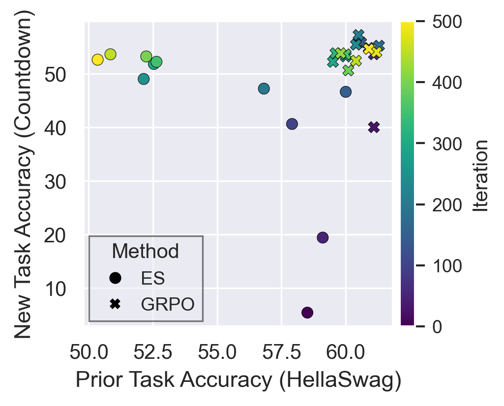
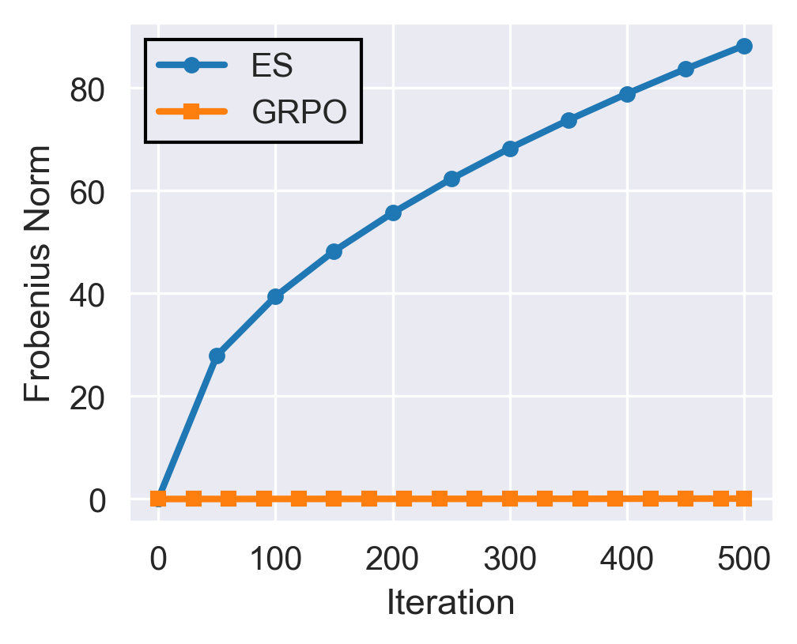
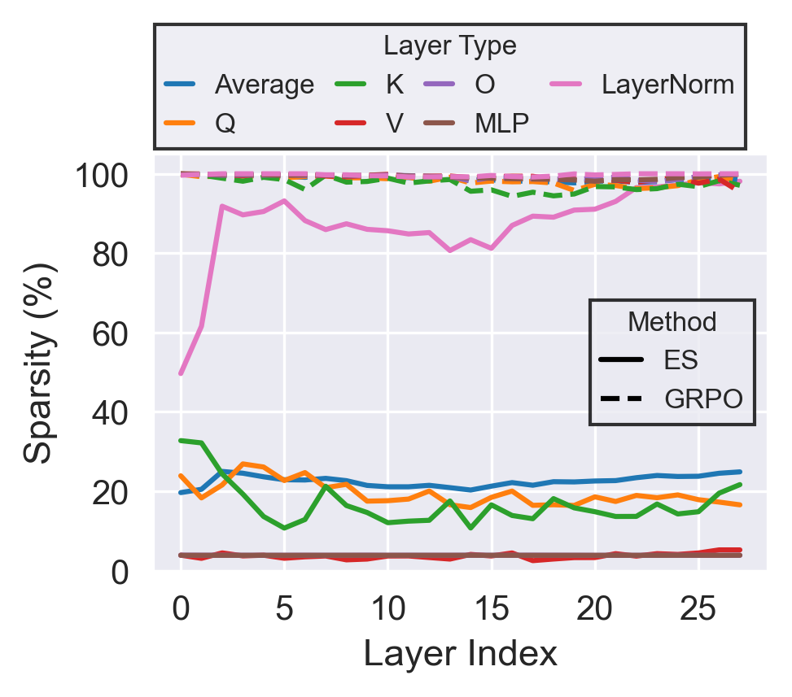

# Evolutionary Strategies at Scale lead to Catastrophic Forgetting

This repository contains implementations and experiments comparing **Evolution Strategies (ES)** and **Group Relative Policy Optimization (GRPO)** for fine-tuning large language models. The codebase provides tools for training, evaluation, and analysis of weight update sparsity patterns between these two optimization approaches.

## Overview

This repository implements two distinct fine-tuning methodologies:

- **Evolution Strategies (ES)**: A gradient-free optimization method that uses population-based weight perturbations to optimize language models
- **Group Relative Policy Optimization (GRPO)**: A gradient-based policy optimization method implemented via the VeRL framework

Both methods are evaluated on multiple reasoning tasks including Countdown puzzles, GSM8K, MATH, and OlympiadBench.

### Key Results

<div align="center">
  
  
  
</div>

<p align="center">
  <em>Left: Countdown vs HellaSwag performance across iterations | Center: Frobenius norm of weight updates | Right: Layer-wise sparsity comparison</em>
</p>

## Figures

Key results and visualizations from our experiments:

### Main Results


*Comparison of ES and GRPO performance across different tasks*

### Sparsity Analysis


*Layer-wise sparsity comparison between ES and GRPO weight updates*

### Training Curves


*Training dynamics showing reward progression over iterations*

**Note:** To add figures, place image files (PNG, JPG, or PDF) in a `figures/` directory in the repository root, then reference them using the markdown syntax above.

## Features

- 🚀 **Distributed Training**: ES implementation using Ray/vLLM for efficient multi-GPU training
- 📊 **Comprehensive Evaluation**: Tools for evaluating models across multiple tasks
- 🔍 **Sparsity Analysis**: Visualization and analysis of weight update patterns
- 📈 **Experiment Tracking**: WandB integration for monitoring training progress
- 🎯 **Multiple Tasks**: Support for Countdown, GSM8K, MATH, and OlympiadBench datasets
- 💾 **Flexible Data Formats**: Support for both JSON and Parquet dataset formats

## Installation

### Prerequisites

- Python 3.10+
- CUDA-capable GPUs (recommended)
- Multiple GPUs for distributed training (optional but recommended)

### Setup

1. **Clone the repository:**
   ```bash
   git clone <repository-url>
   cd es
   ```

2. **Install ES dependencies:**
   ```bash
   cd es_experiments_implementation
   pip install -r requirement.txt
   ```

3. **Install GRPO dependencies:**
   For GRPO experiments, you'll need to install [VeRL](https://verl.readthedocs.io/en/latest/start/install.html):
   ```bash
   # Follow VeRL installation instructions
   # Then navigate to grpo_experiments_implementation
   cd ../grpo_experiments_implementation
   ```

## Quick Start

### Evolution Strategies (ES) Fine-Tuning

Train a model using ES on the Countdown task:

```bash
cd es_experiments_implementation

python countdown_run_vllm_template.py \
  --model_name Qwen/Qwen2.5-1.5B-Instruct \
  --hf_cache_dir ./hf_cache \
  --precision fp16 \
  --num_processes 4 \
  --data_sample 200 \
  --num_iterations 500 \
  --task countdown \
  --reward_method norm \
  --apply_chat_template \
  --eval_every 10 \
  --reward_fn_file countdown_reward.py \
  --reward_fn_name reward_function \
  --logs_dir logs \
  --ckpt_dir checkpoints \
  --save_model_every 50 \
  --wandb \
  --wandb_entity <your_entity> \
  --wandb_project <your_project> \
  --wandb_run_name <run_name> \
  --verbose
```

**Key Parameters:**
- `--num_processes`: Number of Ray/vLLM engines (GPUs) to use
- `--population_size`: Number of perturbations per iteration (default: 30)
- `--num_iterations`: Number of ES iterations
- `--task`: Task name (countdown, gsm_8k, math, olympiadbench)
- `--reward_method`: Reward normalization method (norm, norm_relu, advantage, etc.)

For more details, see the [ES README](es_experiments_implementation/README.md).

### GRPO Fine-Tuning

Train a model using GRPO:

```bash
cd grpo_experiments_implementation/countdown

# Adjust GPU settings in the script first
bash grpo_llama_experiment.sh
```

The GRPO scripts use VeRL and require configuration of GPU settings. See the [GRPO README](grpo_experiments_implementation/README.md) for details.

## Evaluation

Evaluate trained models on multiple tasks:

```bash
cd es_experiments_implementation

python evaluation_script.py \
  --tasks countdown hellaswag \
  --es_models_to_run iter50 iter100 iter500 \
  --grpo_models_to_run grpo_step500 \
  --calc_frobenius \
  --calc_kl \
  --gpu_utilization 0.8
```

Results are saved to `results/es_evaluation_metrics.csv` and `results/evaluation_results_kl.json`.

## Sparsity Analysis

Analyze the sparsity of weight updates between base and fine-tuned models:

### Generate Sparsity Reports

**For ES:**
```bash
python visualize_update_sparsity.py \
  --before Qwen/Qwen2.5-1.5B-Instruct \
  --after checkpoints/my_es_checkpoint \
  --tau 1e-4 \
  --json_out sparsity_report_es.json \
  --plot
```

**For GRPO:**
```bash
python visualize_update_sparsity.py \
  --before Qwen/Qwen2.5-1.5B-Instruct \
  --after checkpoints/my_grpo_checkpoint \
  --tau 1e-4 \
  --json_out sparsity_report_grpo.json \
  --plot
```

### Compare ES vs. GRPO Sparsity

After generating both reports, create a comparison plot:

```bash
python plot_sparsity_comparison.py
```

This saves the comparison plot to `results/sparsity_comparison.png`.

## Project Structure

```
es/
├── es_experiments_implementation/    # ES fine-tuning implementation
│   ├── countdown/                   # Countdown task files
│   ├── gsm_8k/                      # GSM8K dataset
│   ├── math/                        # MATH dataset
│   ├── olympiadbench/               # OlympiadBench dataset
│   ├── countdown_run_vllm_template.py  # Main ES training script
│   ├── evaluation_script.py          # Model evaluation
│   ├── visualize_update_sparsity.py # Sparsity analysis
│   └── plot_sparsity_comparison.py  # Comparison plotting
│
├── grpo_experiments_implementation/ # GRPO fine-tuning implementation
│   ├── countdown/                   # Countdown GRPO experiments
│   ├── gsm8k/                       # GSM8K GRPO experiments
│   ├── math/                        # MATH GRPO experiments
│   ├── olympiad_bench/              # OlympiadBench GRPO experiments
│   └── data/                        # Shared datasets
│
└── README.md                        # This file
```

## Supported Tasks

- **Countdown**: Mathematical puzzles requiring using numbers to reach a target value
- **GSM8K**: Grade school math word problems
- **MATH**: Mathematical reasoning problems
- **OlympiadBench**: Competition-level mathematics problems

## Documentation

- [ES Implementation Guide](es_experiments_implementation/README.md) - Detailed ES training and evaluation instructions
- [GRPO Implementation Guide](grpo_experiments_implementation/README.md) - GRPO training setup and configuration

## Citation

If you use this code in your research, please cite our paper (citation coming soon):

```bibtex
@article{,
  title={Evolutionary Strategies at Scale lead to Catastrophic Forgetting},
  author={Immanuel Abdi*, Akshat Gupta*, Micah Mok, Alexander Lu, Nicholas Lee, Gopala Anumanchipalli},
  year={2026},
  url={},
}
```

## Contributing

Contributions are welcome! Please feel free to submit issues or pull requests.